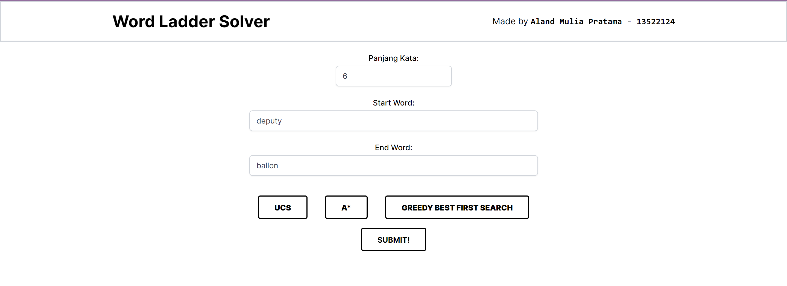

  

# 📚🪜 Word Ladder Solver Program 

> 🌐 Web-Based Word Ladder Solver Program by using Uniform Cost Search (UCS), Astar, and Greedy Best First Search (GBFS) Algorithms

🎓 **Project Background:**
I created the Word Ladder Solver Website Program as part of my Algorithm Strategies third assignment during my fourth semester in the Computer Science program at Bandung Institute of Technology.

## 🪪 Contributors
| Nama | NIM |
|---|---|
| Aland Mulia Pratama | 13522124 |

## 📝 Description
Word Ladder, also known by various names such as Doublets, word-links, or paragrams, is a famous word game invented by Lewis Carroll in 1877. In this game, players are given two initial words called the start word and end word, and the goal is to find a chain of words that connects the two given words. Each word in the chain must differ by only one letter from the previous word.

## 🪛 Configuration Guide

### Front-End Setup:
1. Clone the repository to your local files. Access the repository [here](repository-link).
2. Open the terminal and ensure that the directory is set to `Tucil3_13522124/src/frontend`.
3. Run `npm install` to activate the React-JS framework and any dependencies needed by the website locally.
4. Execute `npm run dev`.

### Back-End Configuration:
1. Make sure to install JAVA Programming Language. You can access the GO Programming Language Installer [here](https://www.oracle.com/id/java/technologies/downloads/). Make sure to add PATH during installation on your device.
2. After the JAVA Programming Language is successfully installed, download the Apache Maven [here](https://dlcdn.apache.org/maven/maven-3/3.8.8/binaries/apache-maven-3.8.8-bin.zip). Video guide for Apache Maven installation can be watch [here](https://youtu.be/YTvlb6eny_0?si=8fnhUVeDCMc58ZKB).
3. After Apache Maven is successfully installed, change the directory to `Tucil3_13522124/src/backend/tucil3_13522124`.
4. Run the backend by executing `mvn spring-boot:run` on the terminal.

## 🏃‍♂️ How to Run
1. Access the Word Ladder Solver website page at http://localhost:3000.
2. Enter the starting word and the end word of the word ladder problems. Word inputs length restricted by the word length input itself.
3. After that, you can select the type of algorithm (UCS/A*/GBFS). Inputs cannot be submitted until you have chosen the type of algorithm.
4. Once everything has been verified as correct, you can press the submit button and wait for the results of the Word Ladder Solution from start word to end word.

## 📸 Screenshots

  
  
<i>Input Program</i>

  
  
<i>Solution Generated by Program</i>

